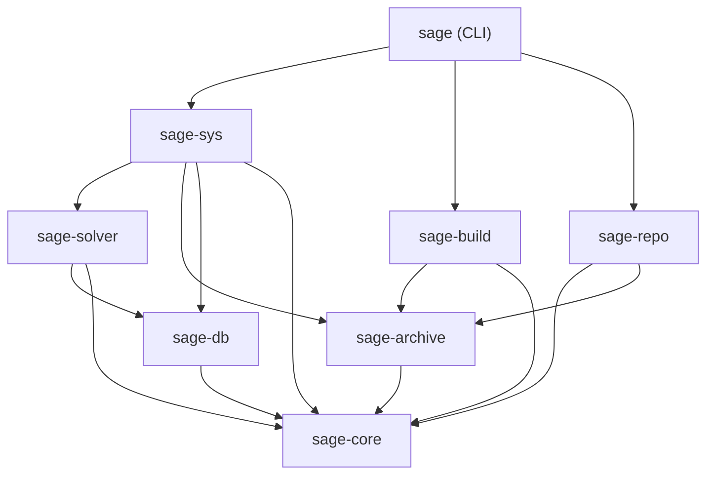

# Sage 0.4.0: 架构设计与 Workspace 拓扑规范

## 1. 架构目标与工程预算

- **首发重写版本**: `0.4.0`
- **代码规模硬约束**: 全项目 Rust 代码总量严格控制在 **9,000 行以内**。
- **绝对零硬编码与完全可扩展性 (Zero-Hardcoded Business Logic)**:
  - **触发器完全数据驱动**: 引擎内不内嵌任何特化触发器逻辑，全部由 `/usr/share/sage/triggers/*.toml` 与 `/etc/sage/triggers.d/*.toml` 声明。
  - **Init 服务生成完全解耦**: 引擎内不内嵌针对特定 Init 系统的硬编码，全部由 `rclass/init-*.toml` 模板引擎渲染。
  - **编译器/工具链完全解耦**: 引擎内不内嵌 CMake/Cargo 等编译器参数，由 `rclass/*.toml` 阶段脚本驱动。
  - **零硬编码镜像 URL**: 软件源地址完全由配置文件提供。
- **全链路统一 LMDB 极速存储 (Unified LMDB Ecosystem)**:
  - **本地与远端全量统一**: 本地已安装状态（`/var/lib/sage/data.mdb`）与软件源远端索引（`/var/cache/sage/channels/<channel>/index.mdb`）**全部采用 LMDB (`heed`) 存储**。
  - **只读 mmap 零反序列化**: 无论本地查询还是远端依赖求解，均通过只读内存映射以单指令/微秒级速度直接访问 B+ 树数据。
- **原生多版本共存 (Native Multi-Version Slots & Multi-Channels)**:
  - 核心领域实体为 `(Channel, PackageName, Slot)`。同名包的不同 Slot/不同 Channel 在求解器与数据库中天然共存。
- **极速冷启动**: 纯 CLI 设计，冷启动耗时控制在 **< 5ms**。

---

## 2. 外部生态选型表 (No Reinventing Wheels)

| 功能领域 | 选用 Crate / 系统工具 | 性能优势 |
| :--- | :--- | :--- |
| **依赖求解 (SAT)** | `pubgrub` | 高性能 CDCL 求解与完备原因树诊断，零递归爆栈。 |
| **全链路数据库 (Local & Remote)** | `heed` (LMDB Rust 绑定) | 单写多读、`mmap` 零拷贝读取、极高并发吞吐。 |
| **归档与压缩** | `tar` + `zstd` + `rayon` | 多核并行流式 ZSTD 解压与确定性归档。 |
| **安全隔离** | `bwrap` (Bubblewrap) + `fakeroot` | 纳秒级轻量 Linux 命名空间隔离。 |
| **CLI 前端** | `clap` (derive) + `indicatif` | 极简、低二进制膨胀、高效进度条渲染。 |
| **网络引擎** | `reqwest` (rustls) / `ureq` | 异步 HTTP Range 分块并发与流式 SHA-256 哈希。 |

---

## 3. Cargo Workspace 拓扑结构

```text
sage/
├── Cargo.toml                  # Workspace 根配置
├── AGENTS.md                   # 导航与提交规范
├── docs/                       # 独立规范与模块文档库
├── rclass/                     # 通用构建类库 (e.g. cmake.toml, cargo.toml, init-openrc.toml)
├── recipes/                    # 官方包配方树
└── crates/
    ├── sage-core/              # 基础领域模型 (Version, Slot, PackageKey, Dep, Lock)
    ├── sage-db/                # LMDB/heed 封装 (Packages, Files, Operations)
    ├── sage-archive/           # tar.zst 流式归档与 openat/reflink 安全解包
    ├── sage-solver/            # PubGrub 适配、LMDB 索引零拷贝点查、多 Slot 求解
    ├── sage-sys/               # 声明式 TriggerEngine, rclass Init 模板渲染, 多 Python Channel 管理
    ├── sage-build/             # bwrap 沙箱驱动, rclass 阶段执行, ptrace 审计
    ├── sage-repo/              # 软件源 LMDB 索引同步, Ed25519 验签, 分块下载
    └── sage/                   # 纯 CLI 二进制命令行入口
```

### 依赖有向无环图 (Dependency DAG)



---

## 4. 模块代码量预算分配 (Line-of-Code Budget)

| Crate | 预估代码行数 (LoC) | 核心性能优化与职责 |
| :--- | :--- | :--- |
| `sage-core` | ~800 | `(Channel, Name, Slot)` 代数、`vercmp`、`ConstraintOp`、Host Lock |
| `sage-db` | ~1,100 | `heed` mmap 零拷贝查询、多 Channel 隔离表、崩溃前向重放 |
| `sage-archive` | ~800 | `openat` 防逃逸、Rayon 并发流式解压、`files.idx` 校验 |
| `sage-solver` | ~900 | PubGrub 适配、LMDB 零拷贝按需点查、Slot 正交求解 |
| `sage-sys` | ~1,600 | 声明式 Glob 触发器、`rclass` Init 模板渲染、多 Python Channel 管理、Rebuild 调和 |
| `sage-build` | ~1,700 | `bwrap` 沙箱、features、临时构建依赖、交叉工具链、产物切分与 ELF 扫描 |
| `sage-repo` | ~600 | LMDB 索引下载解压与 Ed25519 验签、HTTP Range 多分块并发下载 |
| `sage` (CLI) | ~500 | `clap` 命令行解析、`indicatif` 进度渲染与输出 |
| **总计** | **< 9,000** | **全链路 LMDB、零硬编码、极致紧凑、极高性能** |

The workspace Rust budget is 9,000 lines. Feature and architecture variability
stays in schema-v1 TOML; Rust performs only generic validation, folding, solving,
and execution.
