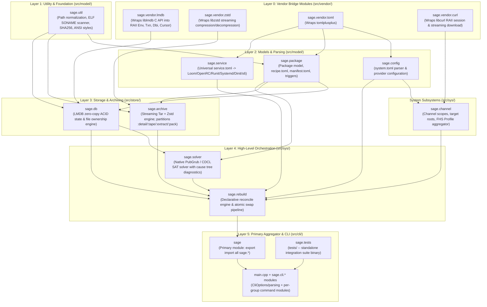

# Sage C++23 Module Reference & Dependency Topology

**Sage** is architected using **100% C++23 Modules (`.cppm`)**. There are zero legacy header files in business logic.

---

## 1. Module Dependency DAG

---

## 2. Vendor Module Specifications

### `sage.vendor.lmdb`
* **Purpose**: Encapsulates LMDB in strict RAII classes (`Env`, `Txn`, `Dbi`, `Cursor`).
* **Exports**:
  - `class Env`: Manages `MDB_env*`, map size, max dbs.
  - `class Txn`: Manages `MDB_txn*`, automatic abort on destruction unless explicitly committed.
  - `class Dbi`: Manages `MDB_dbi` handle and zero-copy string view queries (`get`, `put`, `del`).
  - `class Cursor`: RAII iterator over key-value pairs.

### `sage.vendor.zstd`
* **Purpose**: Encapsulates Zstandard streaming API in RAII.
* **Exports**:
  - `class StreamDecompressor`: Wraps `ZSTD_DCtx*`, feeds compressed chunks and yields decompressed buffers.
  - `class StreamCompressor`: Wraps `ZSTD_CCtx*`, ingests raw bytes and flushes compressed stream.

### `sage.vendor.curl`
* **Purpose**: Encapsulates `libcurl` in strict RAII for HTTP/HTTPS transfers.
* **Exports**:
  - `class CurlSession`: RAII handle for `CURL*` with automatic cleanup.
  - `download_file(url, dest_path, progress_cb)`: Streams remote file to disk with progress callback.
  - `fetch_string(url)`: Fetches remote string/JSON/TOML metadata directly into memory.

### `sage.vendor.toml`
* **Purpose**: Wraps `tomlplusplus` to expose high-level type-safe table and value lookups.
