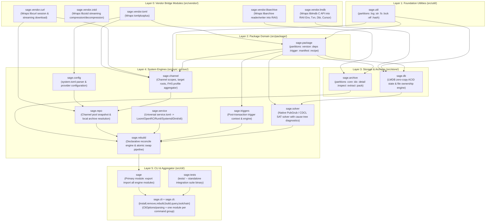

# Sage C++23 Module Reference & Dependency Topology

**Sage** is architected using **100% C++23 Modules (`.cppm`)**. There are zero legacy header files in business logic. Oversized modules are split into **partitions** behind a thin facade that re-exports them, so callers keep a single `import sage.<module>;`.

---

## 1. Module Dependency DAG

---

## 2. Foundation Utilities (`sage.util`, src/util/)

| Partition | Responsibility |
|---|---|
| `:log` | ANSI color palette + `log_info/success/warn/error` console output |
| `:str` | Zero-copy `string_view` helpers: trim/split/join, iterative glob matching, human-readable sizes |
| `:fs` | Path normalization, anchored relative-path cleaning, file metadata snapshots, POSIX env access |
| `:lock` | Process-wide flock-based operation lock (shared for dry-run, exclusive for mutation) |
| `:elf` | Native zero-copy ELF scanner: `DT_SONAME` / `DT_NEEDED` via PT_DYNAMIC + PT_LOAD mapping |
| `:hash` | SHA-256 through OpenSSL EVP (SHA-NI / AVX2 hardware accelerated) |

The primary interface re-exports every partition; business code imports only `sage.util`.

## 3. Package Domain (`sage.package`, src/package/)

| Partition | Responsibility |
|---|---|
| `:version` | epoch-ver-rel comparison algebra (vercmp), release parsing, architecture validation |
| `:deps` | `Dependency` constraints (`>=`, `!=`, ...) and satisfaction checks against `Version` |
| `:trigger` | Capability hooks + transaction triggers, incl. their TOML parse/serialize round-trip |
| `:manifest` | Installed-package manifest (`PackageManifest`), file entries, package identity ordering |
| `:recipe` | `recipe.toml` build配方: multi-source downloads, phase commands, per-recipe flag overrides |

Dependency direction inside the domain: `version -> deps -> trigger -> manifest/recipe`.

## 4. Storage & Archive Engine (src/store/)

### `sage.db`
LMDB-backed registry: packages, files ownership index, provides index, system provider locks. Copy-on-Write transactions with automatic abort on destruction.

### `sage.archive` (partitions in src/store/archive/)
| Partition | Responsibility |
|---|---|
| `:core` | Shared constants + `InspectedPackage` / `ExtractedPackage` result structs |
| `:idx` | `.METADATA/files.idx` per-file integrity index serialize/parse |
| `:detail` | Anchored path vocabulary: normalize data paths, `openat`-based dir walking, anchored removal, conffile modification detection, payload path validation |
| `:inspect` | Constant-cost inspection: reads only the leading `.METADATA` members of an archive |
| `:extract` | One decompression pass over the payload with parallel anchored writes (`WritePool`), batch vs immediate durability |
| `:pack` | Reproducible package creation (inventory + hash pass, single streaming write) and repository `index.toml` generation |

## 5. System Engines (src/sys/, src/svc/)

* **`sage.config`** — parses `/etc/sage/system.toml`: channels, capability providers (exclusive vs shared), build defaults.
* **`sage.channel`** — multi-layer channel model (`system/runtime/toolchain/user`), sub-channel specs, FHS profile symlink aggregation.
* **`sage.repo`** — builds the solver pool from all enabled channels and resolves each candidate to a readable local archive (downloading remote payloads on demand).
* **`sage.solver`** — PubGrub/CDCL dependency resolution with human-readable conflict cause trees.
* **`sage.triggers`** — post-transaction trigger engine: built-in triggers (ldconfig, initramfs, bootloader...) plus package-declared ones, resolved through capability hooks.
* **`sage.rebuild`** — declarative reconcile: diffs desired config vs LMDB state, plans provider swaps, executes them atomically, regenerates service scripts, fires triggers.
* **`sage.service`** (src/svc/service.cppm) — universal `service.toml` compiler targeting Loom/OpenRC/Runit/Systemd/Dinit/s6.

## 6. CLI & Entry Point (src/cli/)

One module per command group; `main.cpp` maps the command word to its module:

| Module | Commands |
|---|---|
| `sage.cli` | Shared vocabulary: `CliOptions`, help text, argument parsing, operation-context acquisition |
| `sage.cli.install` | `install` (+ self-test hooks used by the suite) |
| `sage.cli.remove` | `remove` (cascade expansion, reverse-dependency protection) |
| `sage.cli.rebuild` | `rebuild` |
| `sage.cli.build` | `build`, `repo index` |
| `sage.cli.query` | `query`, `list`, `count`, `verify`, `status` |
| `sage.cli.toolchain` | `toolchain`, `shell`, `channel`, `service` |

## 7. Root Aggregator & Tests

* **`sage`** (src/sage.cppm) — `export import`s every engine module so the CLI stays pure `import`.
* **`sage.tests`** (tests/) — standalone end-to-end regression binary driving the public engine surface.
