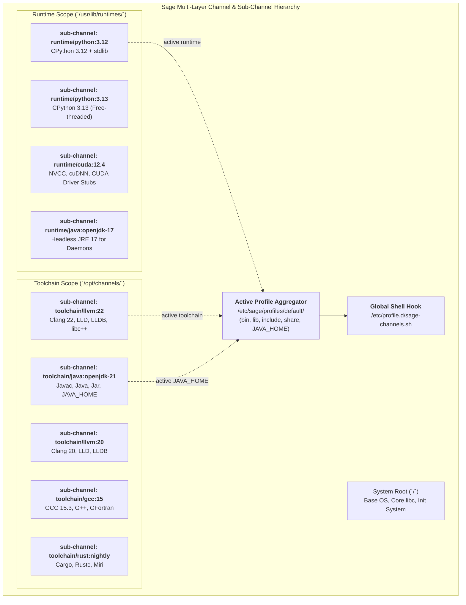

# Sage Next-Step Design: Architecture, Multi-Toolchain & Packaging Specification Master

**Document Version:** 2.0  
**Target Milestone:** Sage v0.2.0 - v0.5.0  
**Status:** Approved Architectural Roadmap & Specification  
**Related Specs:** [ARCHITECTURE.md](ARCHITECTURE.md), [CLI_SPEC.md](CLI_SPEC.md), [MODULES.md](MODULES.md), [AGENTS.md](../AGENTS.md)

---

## 1. Specification File Formats & Explicit Schema Versioning

To ensure long-term stability, deterministic upgrades, and backward/forward compatibility across Sage releases, all configuration files, package recipes, manifests, and index metadata files MUST declare an explicit **`schema_version`** integer field.

```
                               ┌─────────────────────────────┐
                               │ Schema Versioning Hierarchy │
                               └──────────────┬──────────────┘
                                              │
        ┌───────────────────────┬─────────────┴─────────┬────────────────────────┐
        ▼                       ▼                       ▼                        ▼
【系统与通道配置】        【包配方与清单】          【服务与触发器】          【远程仓库索引】
system.toml (v1)        recipe.toml (v1)        service.toml (v1)        index.toml (v1)
channels.toml (v1)      manifest.toml (v1)      triggers.toml (v1)       files.idx (v1)
```

### 1.1 Compatibility Invariants
* **Current Supported Version**: `schema_version = 1`.
* **Forward Compatibility Rule**: If a Sage engine reads a file with `schema_version > CURRENT_SUPPORTED_VERSION`, it MUST fail gracefully with an explicit diagnostic message instructing the user to upgrade `sage`.
* **Backward Compatibility Rule**: When newer schema versions are introduced (e.g. `v2`), future Sage engines MUST maintain zero-copy parsing adapters or migration handlers for older schema versions.

---

## 2. Declarative System & Channel Configurations (`/etc/sage/`)

### 2.1 `/etc/sage/system.toml` (Schema Version 1)
Defines the machine's declared base OS state, root paths, and core virtual provider locks:

```toml
# /etc/sage/system.toml - Declarative System State Specification
schema_version = 1

[system]
root_dir = "/"
db_path = "/var/lib/sage/data.mdb"
cache_dir = "/var/cache/sage"
config_dir = "/etc/sage"
architecture = "amd64" # Target package architecture; also supports "aarch64"

[providers]
# Core mutually exclusive system structural components
init = "openrc"        # Options: loom, openrc, systemd, runit, dinit, s6
udev = "eudev"         # Options: eudev, systemd-udev, mdev-ng
libc = "glibc"         # Options: glibc, musl
```

### 2.2 `/etc/sage/channels.toml` (Schema Version 1)
Defines software sources, priorities, and default toolchain/runtime activation states:

```toml
# /etc/sage/channels.toml - Multi-Layer Channel Specification
schema_version = 1

# Core OS Base Channel (System Root)
[[channels]]
name = "core"
url = "https://pkg.sage-linux.org/core"
scope = "system"
priority = 100
enabled = true

# Isolated Toolchain Sub-Channels
[[channels]]
name = "toolchain/llvm:22"
url = "https://pkg.sage-linux.org/core"
scope = "toolchain"
category = "llvm"
slot = "22"
target_root = "/opt/channels/llvm/22"
priority = 80
enabled = true
active = true          # Active profile symlinked into /etc/sage/profiles/default

[[channels]]
name = "toolchain/gcc:15"
url = "https://pkg.sage-linux.org/core"
scope = "toolchain"
category = "gcc"
slot = "15"
target_root = "/opt/channels/gcc/15"
priority = 70
enabled = true
active = false

# Isolated Runtime Sub-Channels
[[channels]]
name = "runtime/python:3.12"
url = "https://pkg.sage-linux.org/core"
scope = "runtime"
category = "python"
slot = "3.12"
target_root = "/usr/lib/runtimes/python/3.12"
priority = 90
enabled = true
active = true
```

---

## 3. Package Build Recipe & Manifest Specifications

Package architecture is a property of the package artifact, not its service.
The singular `arch` field accepts `amd64`, `aarch64`, or `any`; legacy
`x86_64` remains an alias accepted by existing repositories. `any` is reserved
for architecture-independent payloads such as scripts, metadata, fonts, and
documentation.

### 3.1 `recipe.toml` Specification (Schema Version 1)
The declarative recipe used by `sage build <RECIPE_DIR>` to build reproducible packages:

```toml
# recipe.toml - Package Build Recipe Specification
schema_version = 1

[package]
name = "ripgrep"
version = "14.1.0"
release = "1"
epoch = 0
description = "Fast line-oriented search tool"
license = "MIT OR Unlicense"
channel = "system"       # "system", "toolchain/<cat>:<slot>", "runtime/<cat>:<slot>"
arch = "amd64"           # "amd64", "aarch64", or "any"

[source]
url = "https://github.com/BurntSushi/ripgrep/archive/14.1.0.tar.gz"
sha256 = "33c616959def5f80a763a51cf1feed8c8ea9db583556862e3c6a84fa42f95499"

# Multi-source: a recipe needing more than one download must express ALL of
# them as [[source]] entries (TOML forbids mixing the [source] table with a
# [[source]] array). The first entry is the primary archive unpacked to src/;
# every further entry is downloaded and sha256-verified beside it, then
# staged at src/distfiles/<filename> for the prepare/build phases.
[[source]]
url = "https://github.com/BurntSushi/ripgrep/archive/14.1.0.tar.gz"
sha256 = "33c616959def5f80a763a51cf1feed8c8ea9db583556862e3c6a84fa42f95499"

[[source]]
url = "https://example.com/ripgrep-14.1.0-fixes.patch"
sha256 = "<sha256-of-patch>"

[build_requirements]
# Toolchain requirements with semantic version constraints
channels = [
    "toolchain/rust >= 1.78.0"
]
system_pkgs = ["pcre2 >= 10.40"]

[dependencies]
# Host runtime dependencies (ELF scanner can also auto-infer SONAMEs)
system_deps = ["virtual/libc", "so:libpcre2-8.so.0"]

[provides]
provides = ["ripgrep = 14.1.0", "rg"]

[prepare]
cmds = [
    "tar -xzf 14.1.0.tar.gz --strip-components=1"
]

[build]
cmds = [
    "cargo build --release --locked"
]

[install]
# Staged directly into $DESTDIR / pkg_data directory
cmds = [
    "install -Dm755 target/release/rg ${DESTDIR}/usr/bin/rg",
    "install -Dm644 doc/rg.1 ${DESTDIR}/usr/share/man/man1/rg.1"
]
```

### 3.2 `manifest.toml` Specification (Schema Version 1)
Included inside `.METADATA/manifest.toml` in every `*.pkg.tar.zst` archive:

```toml
# .METADATA/manifest.toml - Installed Package State Manifest
schema_version = 1

[package]
name = "ripgrep"
version = "14.1.0"
release = "1"
epoch = 0
description = "Fast line-oriented search tool"
license = "MIT OR Unlicense"
channel = "system"
arch = "amd64"
installed_size = 5384912

dependencies = [
    "virtual/libc",
    "so:libpcre2-8.so.0"
]

provides = [
    "ripgrep",
    "rg"
]

conflicts = []
```

### 3.3 Universal Daemon Specification `service.toml` (Schema Version 1)
Included inside `.METADATA/service.toml` (or auto-generated for init daemons):

```toml
# .METADATA/service.toml - Universal Service Specification
schema_version = 1

[service]
name = "sshd"
description = "OpenSSH Server Daemon"
exec_start = "/usr/sbin/sshd -D"
exec_stop = "/bin/kill -TERM $MAINPID"
exec_reload = "/bin/kill -HUP $MAINPID"
user = "root"
group = "root"
working_dir = "/"
pid_file = "/run/sshd.pid"
restart = "always"      # "always", "on-failure", "no"
type = "simple"         # "simple", "forking"
after = ["net", "syslog"]
before = []

# Optional specific runtime channel binding
runtime = ""            # e.g. "runtime/java:openjdk-21"
```

### 3.4 File Path Triggers Specification `triggers.toml` (Schema Version 1)
Included inside `.METADATA/triggers.toml` to execute batched post-install/post-remove hooks:

```toml
# .METADATA/triggers.toml - Declarative System Triggers
schema_version = 1

[[triggers]]
name = "ldconfig"
path_patterns = ["usr/lib/*.so*", "lib/*.so*"]
command = "/sbin/ldconfig"
when = "post-transaction"

[[triggers]]
name = "update-ca-certificates"
path_patterns = ["etc/ssl/certs/*", "usr/share/ca-certificates/*"]
command = "/usr/sbin/update-ca-certificates"
when = "post-transaction"

[[triggers]]
name = "update-mime-database"
path_patterns = ["usr/share/mime/*"]
command = "/usr/bin/update-mime-database /usr/share/mime"
when = "post-transaction"
```

---

## 4. Automated ELF Scanner & Package Build Rules

Sage eliminates manual library dependency specification by leveraging its built-in, zero-dependency C++23 native ELF scanner (`sage.util::scan_elf`):

```
┌───────────────────────────────────────────────────────────┐
│              Package Staging Directory (pkg/)              │
└─────────────────────────────┬─────────────────────────────┘
                              │
                              ▼
┌───────────────────────────────────────────────────────────┐
│ Sage Native ELF Scanner (ELF Header + Dynamic Section)    │
└─────────────────────────────┬─────────────────────────────┘
                              │
             ┌────────────────┴────────────────┐
             ▼                                 ▼
【DT_SONAME 提取】                      【DT_NEEDED 提取】
若产物为动态库 (如 libz.so.1):           提取所有链接依赖 (如 libc.so.6):
自动追加到 manifest:                    自动追加到 manifest:
provides = ["so:libz.so.1"]            dependencies = ["so:libc.so.6"]
```

### Packaging Rules:
1. **Zero Library Guessing**: All dynamic binaries (`ET_EXEC`, `ET_DYN`) in `pkg/` are scanned.
2. **Sub-Channel RPATH Enforcement**:
   * For binaries installed into `toolchain/` or `runtime/`, the builder verifies or injects `$ORIGIN/../lib` into `DT_RUNPATH`.
   * Prevents toolchains from accidentally loading mismatched host `/usr/lib` shared libraries.
3. **Deterministic Packaging**:
   * File timestamps in POSIX Tar headers are normalized to reproducible build epochs (`1700000000`).
   * UID/GID are normalized to `0:0` (root).
   * File modes are strictly sanitized: `0755` for directories/executables, `0644` for regular files.

---

## 5. Multi-Toolchain Coexistence & Sub-Channels Architecture



### 5.1 Sub-Channel Addressing Syntax
$$\text{Canonical Spec} := \langle\text{Scope}\rangle/\langle\text{Category}\rangle:\langle\text{Slot}\rangle$$

Examples:
* `toolchain/llvm:22` $\rightarrow$ Target root: `/opt/channels/llvm/22`
* `toolchain/gcc:15.3` $\rightarrow$ Target root: `/opt/channels/gcc/15.3`
* `toolchain/rust:nightly-2026` $\rightarrow$ Target root: `/opt/channels/rust/nightly-2026`
* `toolchain/java:openjdk-21` $\rightarrow$ Target root: `/opt/channels/java/openjdk-21`
* `runtime/python:3.12` $\rightarrow$ Target root: `/usr/lib/runtimes/python/3.12`
* `runtime/cuda:12.4` $\rightarrow$ Target root: `/usr/lib/runtimes/cuda/12.4`

---

## 6. Language Ecosystems Management Specification

### 6.1 Java Ecosystem Management
* **Dual Role**:
  * `toolchain/java:openjdk-21` (Full JDK: `javac`, `java`, `jar`, `native-image`, headers) $\rightarrow$ `/opt/channels/java/openjdk-21`
  * `runtime/java:openjdk-17` (Headless JRE: lightweight JVM for daemons) $\rightarrow$ `/usr/lib/runtimes/java/openjdk-17`
* **`JAVA_HOME` Auto-Bridge**:
  * Global active Java profile symlink: `/etc/sage/profiles/default/runtimes/java`
  * `/etc/profile.d/sage-channels.sh` automatically exports `JAVA_HOME` and adds `$JAVA_HOME/bin` to `PATH`.
* **Service Binding**:
  * Services (e.g. Elasticsearch, Kafka) declare `runtime = "runtime/java:openjdk-21"`.
  * The Reconcile engine automatically injects dedicated `JAVA_HOME` into generated service units without modifying global host Java defaults.

### 6.2 Rust Ecosystem Management
* **Multi-Slot Coexistence**:
  * `toolchain/rust:stable` $\rightarrow$ `/opt/channels/rust/stable/`
  * `toolchain/rust:nightly` $\rightarrow$ `/opt/channels/rust/nightly/`
  * `toolchain/rust:1.80` $\rightarrow$ `/opt/channels/rust/1.80/`
* **Modular Cross-Compilation Targets & Components**:
  * `rust-target-wasm32`, `rust-target-aarch64`, `rust-src` are packaged as extension subpackages unpacked directly into `/opt/channels/rust/<slot>/lib/rustlib/<target>/`.
* **Shared System LLVM**:
  * Sage Rust toolchains dynamically link against system or `toolchain/llvm` shared `libLLVM.so`, eliminating duplicate LLVM binaries (~60% disk savings over rustup).

### 6.3 GCC & LLVM/Clang Toolchains
* **Parallel Multi-Version Slots**:
  * GCC 13, 14, 15 and Clang 18, 20, 22 coexist with zero conflict.
* **Atomic Compiler Switch**:
  * `sage toolchain use llvm:22` or `sage toolchain use gcc:15` executes an $O(1)$ symlink swap in `/etc/sage/profiles/default/bin/cc`, `c++`, `clang`/`gcc`.

---

## 7. Minimum Toolchain Version (MSRV) Resolution Algorithm

When a package recipe declares a toolchain constraint (e.g. `toolchain/gcc >= 14.2`):

```
                      要求: toolchain/gcc >= 14.2
                                   │
                                   ▼
             ┌───────────────────────────────────────────┐
             │ Step 1: 扫描本地已安装的 gcc 子 Channel   │
             │ 本地存在: [gcc:13.2, gcc:15.3]            │
             └─────────────────────┬─────────────────────┘
                                   │
                    ┌──────────────┴──────────────┐
                    ▼                             ▼
       【本地已有满足条件的版本】          【本地版本均过低 (例如只有 13.2)】
       · 命中 gcc:15.3 (>= 14.2)         · 从官方 core 软件源检索
       · 优先复用本地 gcc:15.3            · 自动下载并解包 gcc:15 到
       · 零网络开销，直接复用              /opt/channels/gcc/15/
                                         · 绝不覆盖或删除已有的 gcc:13.2!
```

### PubGrub MSRV Decision Rules:
1. **Local Reuse Priority**: If any installed sub-channel satisfies `>= min_ver`, select the best matching local slot without triggering network operations.
2. **Non-Destructive Fetch**: If no local slot satisfies the constraint, fetch the smallest satisfying slot from remote channels and install it into its designated `/opt/channels/` directory.
3. **Sandboxed Build Injection**: In `sage build`, the chosen toolchain is injected into the build sandbox PATH. The host's active toolchain profile is left completely untouched.

---

## 8. Ephemeral Sandboxed Environments (`sage shell`)

Developers can spawn ad-hoc isolated shell sessions combining arbitrary toolchains and runtimes:

```bash
# Launch a subshell with Clang 22, Python 3.12, and CUDA 12.4
sage shell --with toolchain/llvm:22 --with runtime/python:3.12 --with runtime/cuda:12.4
```

### Dynamic Environment Synthesis:
* `PATH`: Prepends `/opt/channels/llvm/22/bin:/usr/lib/runtimes/python/3.12/bin:/usr/lib/runtimes/cuda/12.4/bin`
* `LD_LIBRARY_PATH`: Prepends corresponding `lib` directories.
* `CPATH` & `PKG_CONFIG_PATH`: Injects headers and pkgconfig search paths.
* `CC` / `CXX`: Injects `clang` / `clang++`.

---

## 9. Comprehensive Implementation Roadmap

| Phase | Milestone | Focus Areas | Key Deliverables |
| :--- | :--- | :--- | :--- |
| **Phase 1** | **v0.2.0** | **Sub-Channel & Schema v1 Standardization** | • `schema_version = 1` across all domain models<br/>• Sub-channel addressing parser `<Scope>/<Cat>:<Slot>`<br/>• LMDB `channels` table extended for sub-channels |
| **Phase 2** | **v0.2.1** | **Toolchain CLI & Profile Swapper** | • `sage toolchain [list\|install\|use\|remove]`<br/>• `sage java [list\|use]` & `sage rust [list\|use]`<br/>• Atomic profile symlink swapper |
| **Phase 3** | **v0.2.2** | **MSRV Resolution & Ephemeral Shell** | • PubGrub MSRV slot matcher in `sage.solver`<br/>• `sage shell --with <sub-channels...>` launcher |
| **Phase 4** | **v0.3.0** | **Build Sandboxing & Triggers** | • Linux namespace isolation (`unshare -m`) in `sage build`<br/>• Post-transaction trigger hook engine (`triggers.toml`) |
| **Phase 5** | **v0.4.0** | **Repository Indexing & Ed25519 Signing** | • `index.toml` (v1) generator<br/>• Ed25519 cryptographic package archive signature verification |
| **Phase 6** | **v0.5.0** | **Parallel Download & Mirror Failover** | • Multi-threaded chunked downloader with Range requests<br/>• Automatic fastest mirror selection & retry failover |
